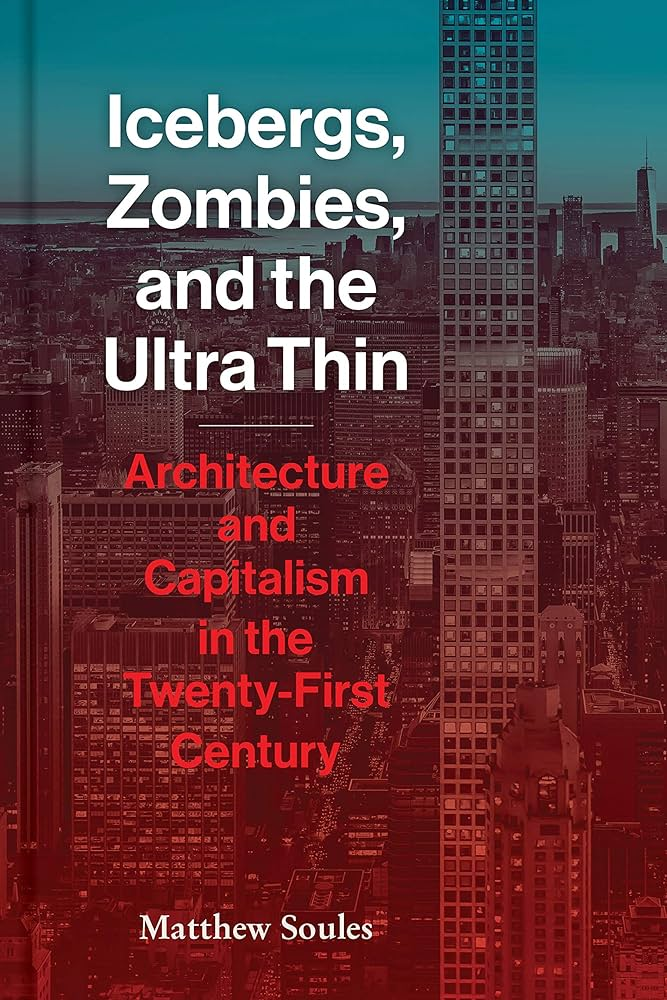

# Intro Global Inequality

Visual Intro to the Dataviz Project about Global Inequality.

The objective of this visual intro is to transmit the topic, the main players and situations in images.

Global inequality has at the center the contrast of the "super rich" and increasing poverty on the othere side.

### One rises above all others

### Everyone else living in bad conditions

## Background

I got inspired by the work and research from Matthew Soules summarised in the book "Icebergs, Zombies and the Ultra Thin.

Credits to

- [TweenMax](https://gsap.com/resources/3-migration/#loading-plugins) by Greensock
- [TextTrailEffect](https://github.com/codrops/TextTrailEffect) by Manoela Ilic
- [imagesLoaded](https://imagesloaded.desandro.com/) by Dave DeSandro
